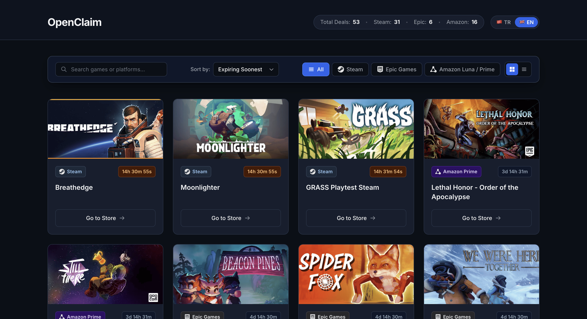

# OpenClaim - Open Source Free Games Tracker

[English](#english) | [Türkçe](#türkçe)

---

<a name="english"></a>
## 🌐 English

An open-source web application that automatically tracks free game deals across Steam, Epic Games Store, and Amazon Luna / Prime Gaming via automated pipelines.

### 🚀 Live Demo

<!-- TODO: demo link -->
🔗 [Open Live App (GitHub Pages)](https://seqat.github.io/OpenClaim/)

---

### 🖼️ Screenshot



---

### ✨ Key Features

- 🤖 **GitHub Actions Automation:** Automatic data fetching and publishing (Cron automation).
- ⚡ **Zero Client-Side API Dependency:** Fast local `games.json` fetching without CORS or rate-limit barriers.
- 🌐 **Multi-Language Support:** Instant switching between Turkish and English (TR / EN).
- 🗂️ **Advanced Filtering & Views:** Smart Sorting, Grid / List view modes, and sticky filter controls.
- 👁️ **Modern Design Aesthetics:** Eye-friendly Slate Dark design system with micro-animations.

---

### 📁 Project Structure

```text
OpenClaim/
├── index.html                 # Main HTML entry page
├── games.json                 # Free games data (generated by GitHub Actions)
├── backend/
│   ├── main.py                # Pipeline entry point, normalization & deduplication
│   ├── scrapers/              # Platform scraper modules
│   │   ├── gamerpower.py      # Steam & Epic Games (GamerPower API) scraper
│   │   └── luna.py            # Amazon Luna / Prime Gaming (Playwright) scraper
│   └── utils/
│       └── date_helpers.py    # ISO date & expiration date parsing helpers
├── frontend/
│   ├── css/                   # Design system & component stylesheets
│   └── js/                    # ES6 modules (api, app, ui, i18n, state)
└── tests/                     # Pytest test suite
```

---

### 🛠️ Tech Stack

- **Backend / Pipeline:** Python (`Playwright`, `Requests`)
- **Automation & CI/CD:** GitHub Actions
- **Frontend:** Vanilla HTML5, CSS3 (Custom Design System), ES6 JavaScript Modules

---

### 💻 Local Development

#### 1. Running Backend Pipeline

```bash
git clone https://github.com/Seqat/OpenClaim.git
cd OpenClaim
python -m venv .venv
source .venv/bin/activate  # Windows: .venv\Scripts\activate
pip install -r requirements.txt
playwright install chromium
python backend/main.py
```

#### 2. Local Frontend Server

```bash
# Run local HTTP server from root directory:
python -m http.server 8000

# Open in browser:
# http://localhost:8000
```

---

### 🧪 Testing

Run unit tests locally:

```bash
pip install -r requirements-dev.txt
python -m pytest
```

---

### ➕ Adding a New Platform Scraper

4-step guide to add a new scraper:

1. **Create Scraper File:** Add a new `.py` file under `backend/scrapers/` (e.g. `backend/scrapers/myplatform.py`).
2. **Implement Fetch Function:** Define an async or sync `fetch_*` function returning `List[Dict[str, Any]]`.
3. **Follow Output Schema:** Ensure each game dictionary contains the following keys:
   - `id`: Unique game ID (`str`)
   - `title`: Cleaned game title (`str`)
   - `platform`: Platform name (`str`, e.g. `"Steam"`, `"Epic Games"`)
   - `store_url`: Game store / claim URL (`str`)
   - `image_url`: Game cover image URL (`str`)
   - `end_date`: ISO formatted expiration date or `None` (`Optional[str]`)
   - `is_permanent`: Permanent library vs limited time access (`bool`)
4. **Integrate into Pipeline:** Import your new scraper in `backend/main.py`, execute it inside `main()`, and append results to `all_games`.

---

### 📄 License

This project is licensed under the [MIT License](LICENSE).

---

<a name="türkçe"></a>
## 🇹🇷 Türkçe

Steam, Epic Games Store ve Amazon Luna / Prime Gaming platformlarındaki ücretsiz oyun fırsatlarını otomatize pipeline ile takip eden açık kaynaklı web uygulaması.

### 🚀 Canlı Demo

<!-- TODO: demo linki -->
🔗 [Canlı Uygulamayı Aç (GitHub Pages)](https://seqat.github.io/OpenClaim/)

---

### 🖼️ Ekran Görüntüsü


---

### ✨ Öne Çıkan Özellikler

- 🤖 **GitHub Actions Otomasyonu:** Otomatik veri çekme ve yayınlama (Cron otomasyonu).
- ⚡ **Sıfır İstemci Taraflı API Bağımlılığı:** CORS ve rate-limit engeline takılmadan yerel `games.json` kullanımı.
- 🌐 **Çoklu Dil Desteği:** Türkçe ve İngilizce (TR / EN) dil seçenekleri.
- 🗂️ **Gelişmiş Filtreleme ve Görünüm:** Akıllı Sıralama, Grid / List görünüm modları ve yapışkan (sticky) filtre çubuğu.
- 👁️ **Modern Arayüz Tasarımı:** Göz dostu Slate Dark tema mimarisi ve mikro-animasyonlar.

---

### 📁 Proje Yapısı

```text
OpenClaim/
├── index.html                 # Ana HTML giriş sayfası
├── games.json                 # Ücretsiz oyun verisi (GitHub Actions tarafından üretilir)
├── backend/
│   ├── main.py                # Pipeline giriş noktası, normalizasyon ve deduplikasyon
│   ├── scrapers/              # Platform scraper modülleri
│   │   ├── gamerpower.py      # Steam & Epic Games (GamerPower API) scraper'ı
│   │   └── luna.py            # Amazon Luna / Prime Gaming (Playwright) scraper'ı
│   └── utils/
│       └── date_helpers.py    # ISO tarih & bitiş tarihi parse yardımcıları
├── frontend/
│   ├── css/                   # Tasarım sistemi & bileşen stilleri
│   └── js/                    # ES6 modülleri (api, app, ui, i18n, state)
└── tests/                     # Pytest test paketleri
```

---

### 🛠️ Teknoloji Yığını

- **Backend / Pipeline:** Python (`Playwright`, `Requests`)
- **Otomasyon & CI/CD:** GitHub Actions
- **Frontend:** Vanilla HTML5, CSS3 (Custom Design System), ES6 JavaScript Modules

---

### 💻 Lokal Geliştirme

#### 1. Backend Pipeline'ı Çalıştırma

```bash
git clone https://github.com/Seqat/OpenClaim.git
cd OpenClaim
python -m venv .venv
source .venv/bin/activate  # Windows: .venv\Scripts\activate
pip install -r requirements.txt
playwright install chromium
python backend/main.py
```

#### 2. Frontend Önizleme (Local Web Server)

```bash
# Kök dizindeyken yerel sunucuyu başlatın:
python -m http.server 8000

# Tarayıcıda açın:
# http://localhost:8000
```

---

### 🧪 Testler

Testleri yerel ortamda çalıştırmak için:

```bash
pip install -r requirements-dev.txt
python -m pytest
```

---

### ➕ Yeni Platform Scraper'ı Ekleme

Yeni bir platform scraper'ı eklemek için 4 adımlı rehber:

1. **Scraper Dosyası Oluşturun:** `backend/scrapers/` dizini altında yeni bir `.py` dosyası açın (ör. `backend/scrapers/myplatform.py`).
2. **Fetch Fonksiyonu Yazın:** `List[Dict[str, Any]]` tipi dönen asenkron veya senkron bir `fetch_*` fonksiyonu tanımlayın.
3. **Çıktı Şemasına Uyarlayın:** Fonksiyondan dönen her sözlük (dictionary) şu alanları içermelidir:
   - `id`: Benzersiz oyun kimliği (`str`)
   - `title`: Temizlenmiş oyun adı (`str`)
   - `platform`: Platform adı (`str`, örn. `"Steam"`, `"Epic Games"`)
   - `store_url`: Oyun mağazası / talep bağlantısı (`str`)
   - `image_url`: Oyun kapak görseli bağlantısı (`str`)
   - `end_date`: ISO formatında bitiş tarihi veya `None` (`Optional[str]`)
   - `is_permanent`: Kalıcı kütüphane mi yoksa süreli erişim mi (`bool`)
4. **Pipeline'a Entegre Edin:** `backend/main.py` içinde yeni scraper fonksiyonunu import edin, `main()` içerisinde çağırıp `all_games` listesine ekleyin.

---

### 📄 Lisans

Bu proje [MIT License](LICENSE) altında lisanslanmıştır.
